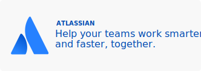
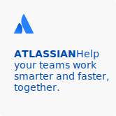

## Motivation for Github Sponsorships

We want to help Open Source developers get paid through sponsorships so that they can continue creating amazing codes and projects that is important for us and helping move the world forward.

## Sponsored by Atlassian

This page is sponsored by Atlassian.

> Products for teams, from startup to enterprise.Plan, track, and release world-class software with the #1 software development tool used by agile teams. Manage any business project including marketing campaigns, HR onboarding, approvals and legal document reviews. [Jira is offering a free trial on all products. Get Started!](https://www.atlassian.com/software/jira/try)

## How does this work?

We work with tech companies that are building tools for software developers. From DevOps companies to developer efficiency companies. You have the option to accept or reject any sponsorship ads.

## Types of Sponsorship Images

#### Large Example

[See these ads in content: Material-UI](examples/MaterialUI.md) 

#### Medium Example

[See these ads in content: Brew](examples/brew.md) 

### Small Example

[See these ads in content: eslint](examples/eslint.md) 

